# TUI Panels and Sidebars

[Back to README](../README.md)

LYRD includes integrated terminal-native panels to support an IDE-like layout
without leaving Neovim.

## File tree

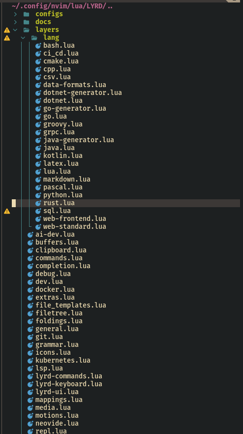

- **Layer**: `layers/filetree.lua`
- Sidebar project tree with Git and diagnostic indicators.

## File explorer modes

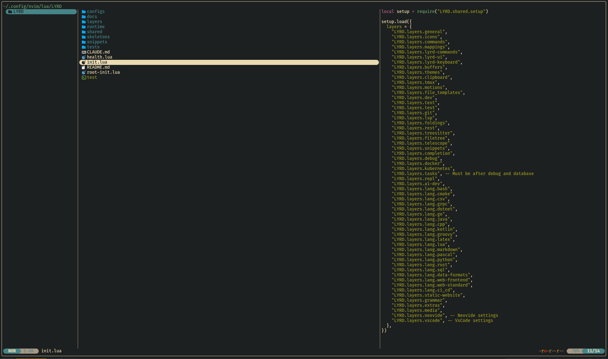

- **Layer**: `layers/filetree.lua`
- Includes yazi-based explorer and oil.nvim editable directory view.

## Git UI

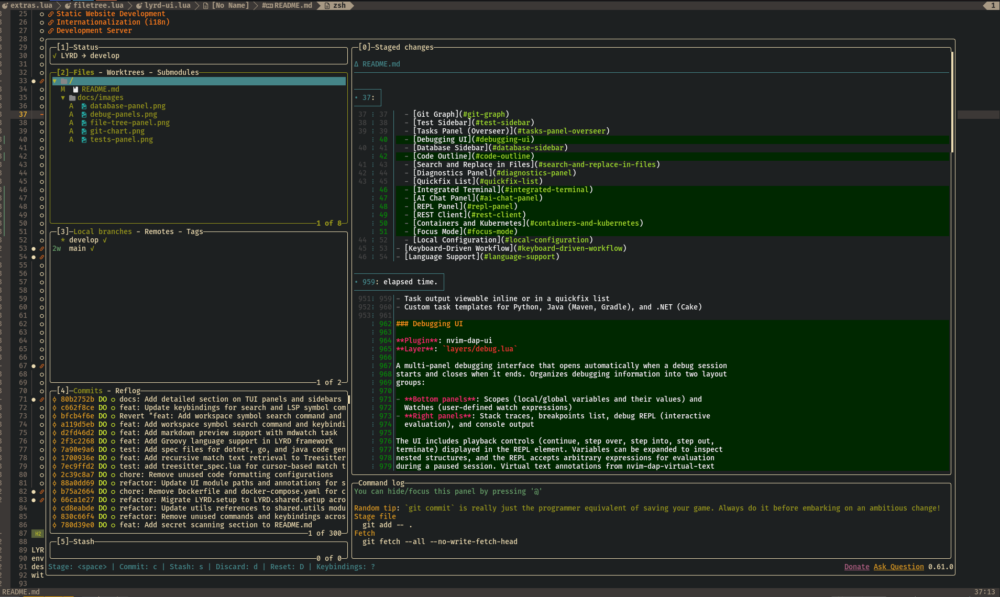 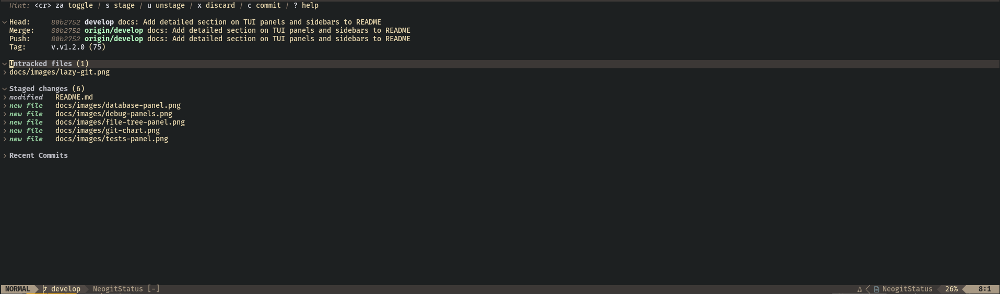

- **Layer**: `layers/git.lua`
- Unified Git workflows through LazyGit, Neogit, Diffview, Gitsigns, conflict
  tools, and PR/issue integration.

## Git graph

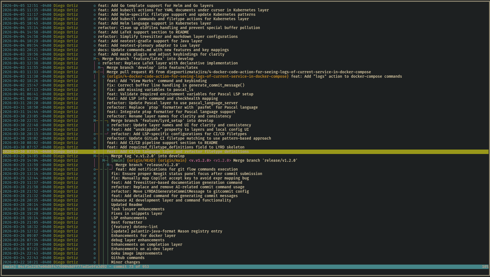

- **Layer**: `layers/git.lua`
- Floating `tig` graph/history UI.

## Test sidebar

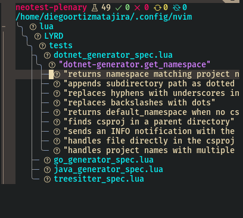

- **Layer**: `layers/test.lua`
- Hierarchical test result explorer with run/debug actions.

## Tasks panel (Overseer)

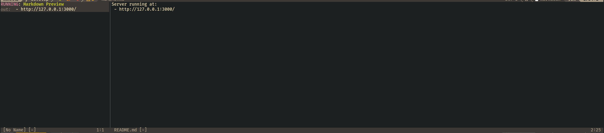

- **Layer**: `layers/tasks.lua`
- Bottom task dock with status, output, and elapsed runtime.

## Debugging UI

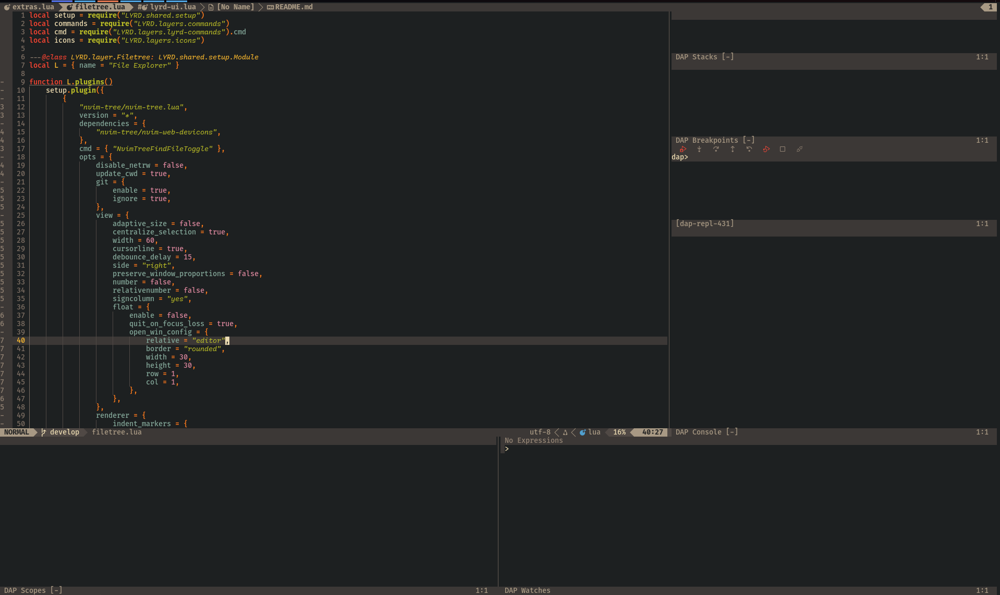

- **Layer**: `layers/debug.lua`
- Multi-panel DAP UI with scopes, stack traces, watches, REPL, console, and
  controls.

## Database sidebar

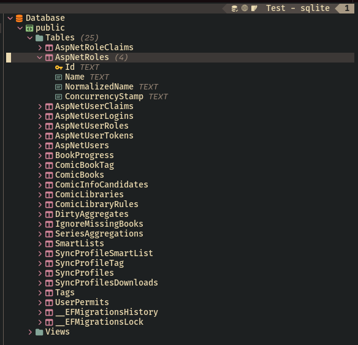

- **Layer**: `layers/lang/sql.lua`
- DB connection/schema/table explorer plus query output panel.

## Code outline

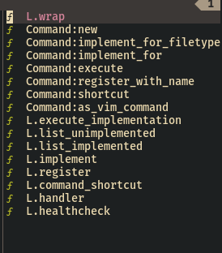

- **Layer**: `layers/telescope.lua`
- Symbol tree for current buffer with jump navigation.

## Search and replace panel

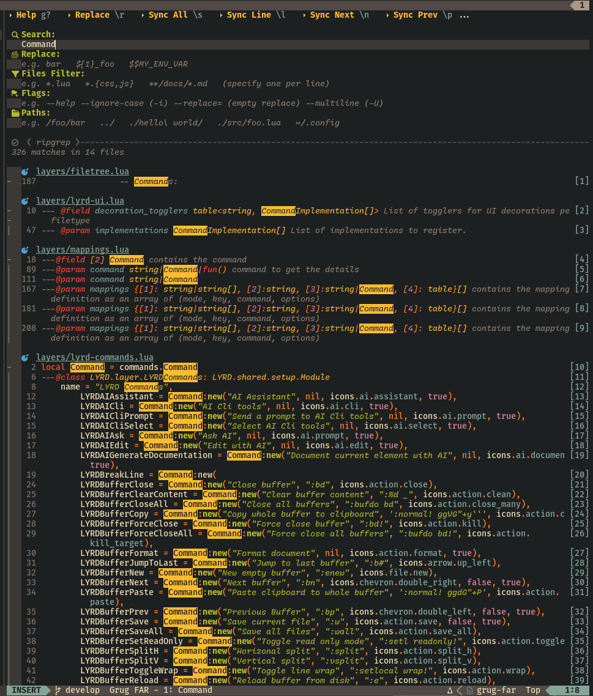

- **Layer**: `layers/lyrd-ui.lua`
- Project/file scoped search-and-replace with preview.

## Diagnostics and quickfix views

- **Layer**: `layers/lsp.lua`
- Trouble-powered diagnostics and quickfix visualization.

## Integrated terminal

- **Layer**: `layers/lyrd-ui.lua`
- Toggleable persistent terminal instances and floating terminal backends.

## AI chat panel

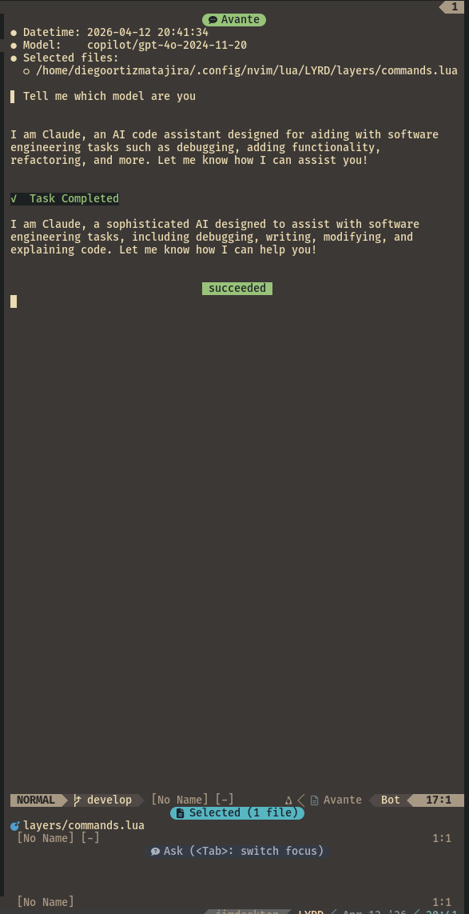

- **Layer**: `layers/ai-dev.lua`
- Sidebar conversation and AI-assisted edit flows.

## REPL panel

- **Layer**: `layers/repl.lua`
- Split REPL session and notebook-like code-cell execution workflow.

## REST client panel

- **Layer**: `layers/rest.lua`
- Execute requests and inspect formatted responses inline.

## Containers and Kubernetes panels

- **Layers**: `layers/docker.lua`, `layers/kubernetes.lua`
- Floating LazyDocker and k9s terminal UIs.

## Focus mode

- **Layer**: `layers/lyrd-ui.lua`
- Dims non-current context for focused editing.

## Local configuration dialog

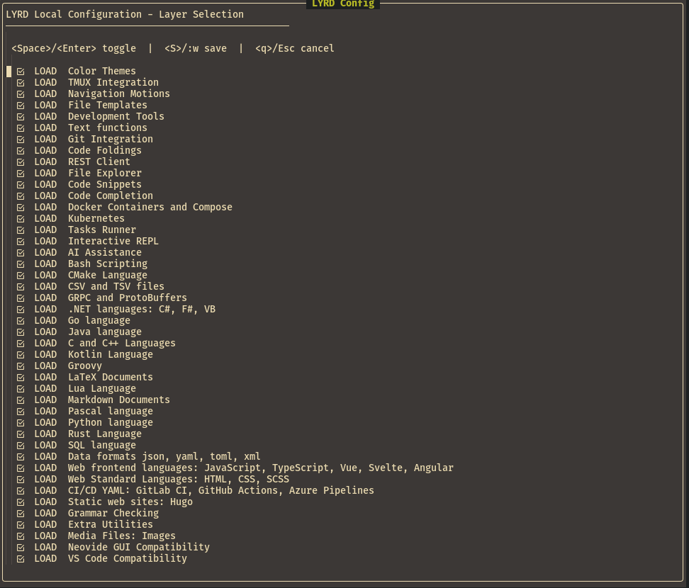

- **Module**: `shared/ui/local_config.lua`
- Toggle skippable layers and persist to local config file.
